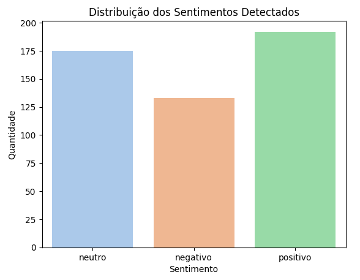

# 🧠 Análise de Sentimentos em Tweets

Este projeto realiza uma análise de sentimentos em tweets, usando Python, Pandas e TextBlob.
500 tweets aleatórios foram usádos para essa análise.

## 📌 Objetivos
- Classificar sentimentos com TextBlob
- Gerar insights visuais sobre opiniões públicas

## 📁 Estrutura
- `data/`: base de dados original
- `notebooks/`: análises e gráficos
- `src/`: funções reutilizáveis
- `requirements.txt`: bibliotecas usadas

## 📊 Exemplo de resultado

